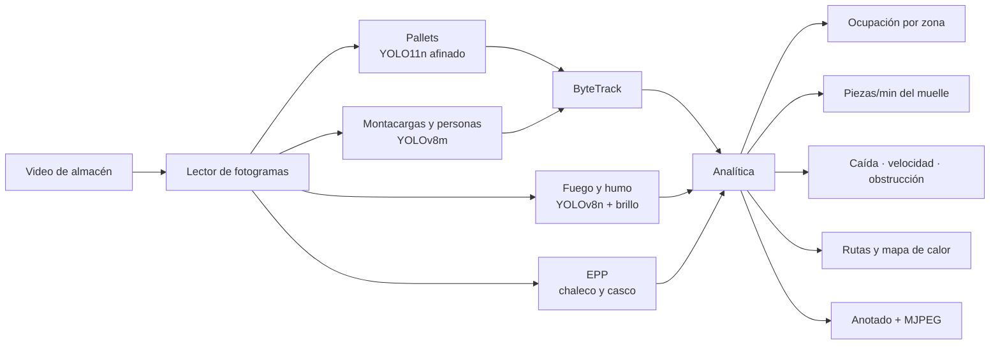
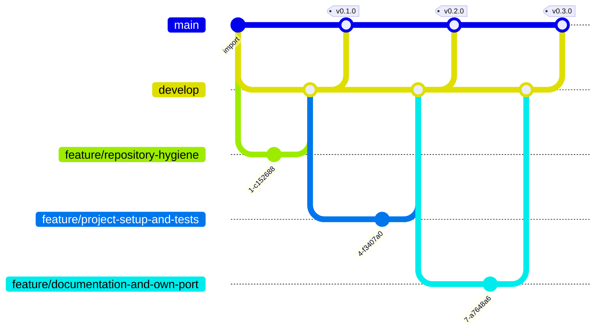

# OMNI Logistics — visión para almacén y muelle

> **Visión computacional · YOLO11 + YOLOv8 + ByteTrack · FastAPI · CUDA o CPU**
>
> 
> 
> 
> 


## El problema

Un almacén no sabe cuánto de cada zona está ocupado ahora mismo. Sabe cuánto
había ayer, cuando alguien lo apuntó. No sabe cuánto tarda de verdad una
descarga, ni por dónde pasan los montacargas, ni se entera de un conato de
incendio hasta que hay humo en el pasillo.

Todo eso está en las cámaras que ya hay. OMNI Logistics lo saca.

| Módulo | Qué responde | Con qué |
|---|---|---|
| **Ocupación** | ¿Cuánto de cada zona está ocupado y desde cuándo? | Pallets detectados dentro de polígonos |
| **Muelle** | ¿Cuánto tarda una carga o descarga? ¿Cuántas piezas por minuto? | Cruces de línea de pallets y montacargas |
| **Seguridad** | ¿Hay fuego o humo? ¿Alguien sin EPP cerca de un montacargas? | Fuego/humo con filtro de brillo, y chaleco/casco |
| **Rutas** | ¿Por dónde pasó cada montacargas? ¿Hay un pasillo bloqueado? | Seguimiento, mapa de calor y detección de obstrucción |

## Qué se ve

| | |
|---|---|
| **Ocupación por zona**<br><br><sub>pallets dentro de cada polígono, y desde cuándo</sub> | **Muelle: carga y descarga**<br><br><sub>cruces de línea → piezas por minuto</sub> |
| **Fuego y humo**<br><br><sub>detección confirmada con brillo, para no marcar cada foco</sub> | **Rutas y trazabilidad**<br><br><sub>recorrido de cada montacargas y mapa de calor</sub> |
| **Editor de zonas**<br><br><sub>polígonos y líneas sobre el primer fotograma</sub> |  |

## Cómo funciona



**Los modelos se cargan cuando se usan**, no al arrancar. Son cuatro; cargarlos
todos de golpe tarda y ocupa memoria aunque la sesión solo necesite uno. Si
falta alguno, el módulo que lo usa aparece **desactivado en la interfaz** en
lugar de reventar a media ejecución.

**El fuego se confirma con brillo.** Un detector de fuego a secas marca como
incendio cualquier reflejo de foco, y en un almacén hay focos por todas partes.
Exigir además brillo alto dentro de la caja quita casi todos los falsos
positivos. Es la diferencia entre una alarma que se atiende y una que en una
semana nadie mira.

### Los modelos, y por qué esos

| Modelo | Para qué | De dónde |
|---|---|---|
| `pallet_n_640.pt` | Pallets | YOLO11n afinado con pallets de madera a 640 px |
| `forklift_kerem.pt` | Montacargas y personas | YOLOv8m de keremberke |
| `fire_smoke.pt` | Fuego y humo | YOLOv8n, con el filtro de brillo encima |
| `ppe_vest.pt` | Chaleco y casco | Detector de EPP, para marcar infracciones |
| `yolo11n.pt` | Base genérica | El único con URL pública |

## Probarlo

```bash
pip install -r requirements.txt
python download_models.py
python -m uvicorn backend.main:app --port 8021    # o arrancar.bat
```

Abre <http://localhost:8021>, elige el módulo, elige el video, dibuja las zonas
sobre el primer fotograma y pulsa procesar.

> Cada MVP de la familia tiene su propio puerto —8000 PPE, 8010 Retail,
> 8020 Agro, 8021 Logistics, 8030 Guard— para poder tener varios levantados a
> la vez. Antes Agro y Logistics compartían el 8020 y el segundo no arrancaba.

### Por qué los pesos y los videos no están aquí

No son código: son la entrada y la salida del sistema. Varios pasan de los
100 MB que GitHub rechaza de plano, y clonar el proyecto pasaría de segundos a
minutos para traerse archivos que se regeneran o se descargan.

```bash
python download_models.py          # los recupera y dice cuáles faltan
```

De los cinco modelos, **solo `yolo11n` tiene URL pública**. Los otros cuatro
están afinados para este caso. El script los nombra y dice qué son, en vez de
fallar a mitad de descarga y dejar un archivo truncado que carga bien y revienta
mucho después.

## Cómo está montado

```
backend/
├── config.py     rutas de modelos y umbrales, por variable de entorno
├── detector.py   los cuatro modelos, cargados solo cuando se usan
├── processor.py  el bucle: leer, detectar, seguir, anotar, emitir
├── analytics.py  detecciones → ocupación, tiempos, eventos y rutas
├── zones.py      polígonos y líneas sobre el primer fotograma
├── compat.py     el parche de NumPy 2 para el conteo de línea
└── main.py       API y streaming MJPEG
frontend/         interfaz sin framework
scripts/          generadores de las capturas y del diagrama de ramas
data/zones/       zonas ya dibujadas para los videos de ejemplo
```

Los videos van en subcarpetas por módulo (`videos/01_ocupacion/`, …) y el
listado se filtra según el módulo elegido: cada apartado enseña solo lo suyo.

## Pruebas

```bash
python -m pytest -q          # 8, sin video ni modelos ni GPU
```

`test_eventos.py` fabrica detecciones a mano y las pasa por `Analytics`: una
persona que se cae, un montacargas que corre de más y un pallet en mitad de la
ruta de evacuación. Lo que fija es que cada evento salte **una sola vez** —
cuatro segundos en el suelo son una caída, no cien alarmas seguidas.

Antes esto no era una prueba: imprimía números y calculaba un booleano que
nadie comprobaba, así que pytest no recogía nada.

```bash
python comprobar_fuego.py    # necesita pesos, videos y GPU
```

Comprobación **manual**, aparte, porque mide lo único que no se puede fabricar
sintéticamente: que el filtro de brillo distinga un incendio de los focos del
almacén. Pasa dos videos, uno con fuego y otro sin él, y **los dos** tienen que
salir bien.

<!-- GITFLOW:inicio -->

## Cómo se trabajó

**10 commits**, **6 fusiones** y **3 etiquetas** (`v0.1.0`, `v0.2.0`, `v0.3.0`). al generar este bloque. Cada rama entra con `--no-ff`: un merge aplastado ahorra una línea y borra la única prueba de que aquello fue una tarea con principio y final.



| Prefijo | Para qué | Ramas |
|---|---|---|
| `feature/` | trabajo acotado, se integra en develop | 3 |
| `develop/` | rama de integración | 3 |

| Rama | Responsabilidad | Regla de salida |
|---|---|---|
| `main` | Lo que ve primero quien llega al repositorio | Solo recibe trabajo terminado y con las pruebas en verde |
| `develop` | Integración: aquí se junta todo antes de subir | Merge `--no-ff` desde una rama `feature/*` |
| `feature/*` | Un trabajo acotado, nombrado por lo que hace | Merge `--no-ff` a `develop` con sus pruebas escritas |

Los mensajes siguen *Conventional Commits* y están en inglés. Explican **por qué**, no qué: el *qué* ya está en el diff. Varios cuentan el fallo que arreglan y cómo se descubrió, que es lo que sirve dentro de seis meses.

<sub>El diagrama lo genera <a href="scripts/gitflow.py"><code>scripts/gitflow.py</code></a> leyendo <code>git log --merges</code>.</sub>

<!-- GITFLOW:fin -->

---

## Licencia

Uso interno de ApexCorp S.A.C.

<sub>OMNI Logistics · ApexCorp S.A.C. — desarrollado por
<a href="https://github.com/danielyatacoblas">Daniel Yataco Blas</a></sub>
